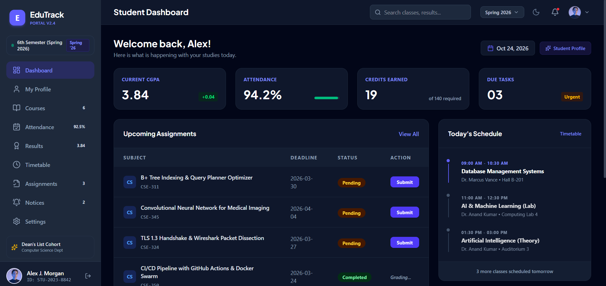
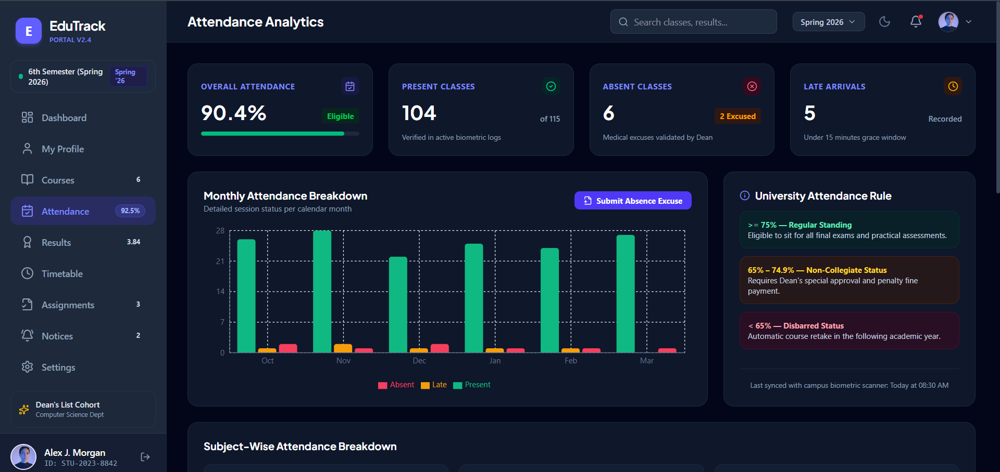
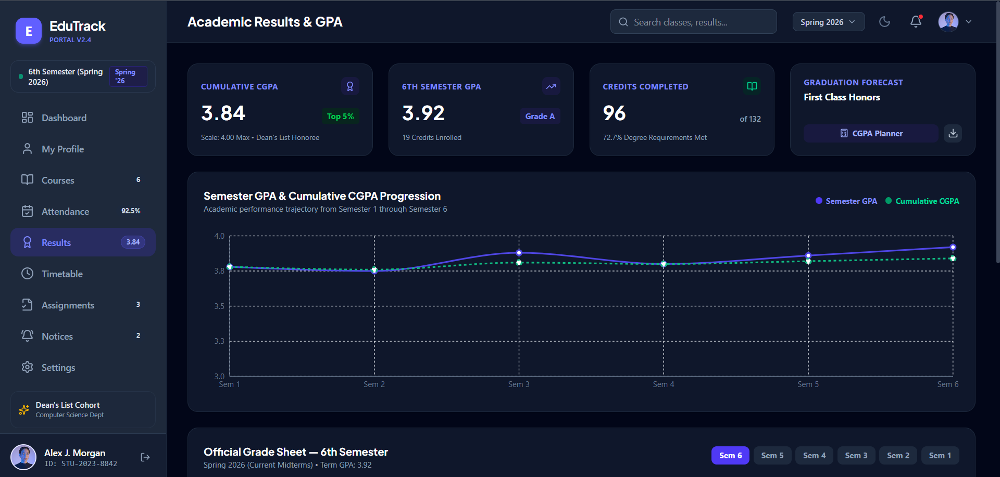

# EduTrack – Student Portal

EduTrack is a modern student portal built with React, TypeScript, and Vite. It provides a clean interface for students to manage academic information.

## Live Demo

[View EduTrack Live](https://edu-track-ashy.vercel.app/)

## Features

- Student Dashboard
- Student Profile
- Courses
- Attendance Tracking
- Results
- Timetable
- Assignments
- Notices
- Settings
- Responsive User Interface

## Technologies Used

- React
- TypeScript
- Vite
- CSS
- JavaScript
- Git & GitHub

## Project Structure

```text
edu-track/
├── src/
│   ├── components/
│   ├── context/
│   ├── data/
│   └── types/
├── public/
├── package.json
└── README.md
```

## Installation

Clone the repository:

```bash
git clone https://github.com/Ahmed-dev01/edu-track.git
```

Navigate to the project:

```bash
cd edu-track
```

Install dependencies:

```bash
npm install
```

Start the development server:

```bash
npm run dev
```


## Screenshots

### Dashboard


### Courses


### Attendance


### Results


## Live Demo

[View EduTrack Live](https://edu-track-ashy.vercel.app/)

## Author

**Ahmed Raza**

GitHub: [Ahmed-dev01](https://github.com/Ahmed-dev01)